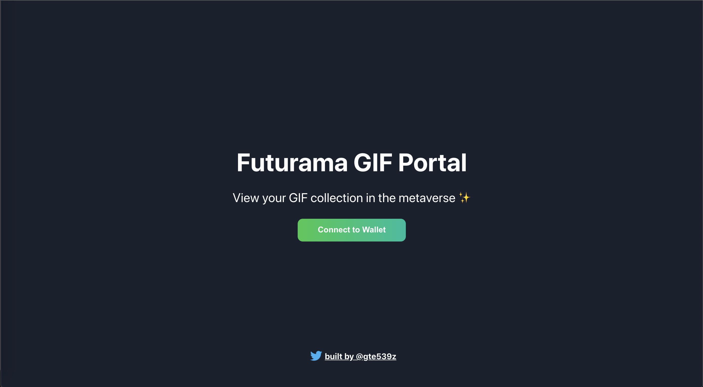
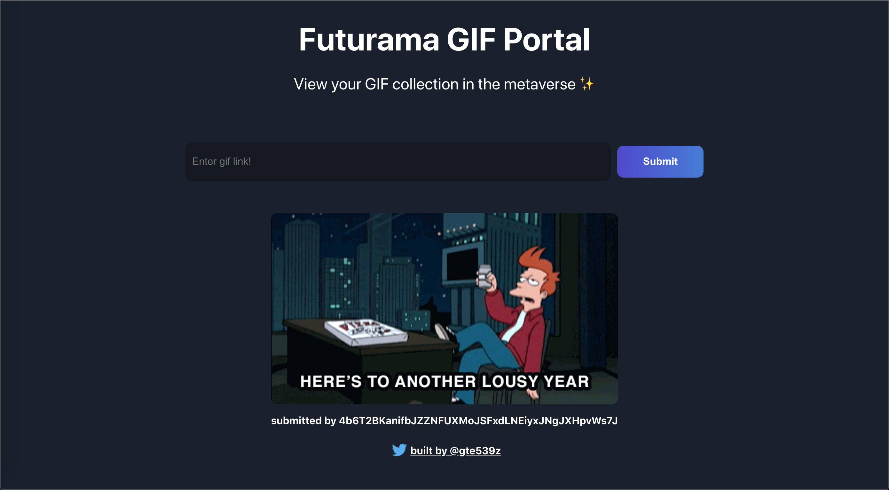

## Project: Build a Web3 app on Solana with React and Rust
This repository contains the frontend for my version of the `Build a Web3 app on Solana with React and Rust` on [buildspace](https://buildspace.so/).

The tutorial was a guide to create a GIF wall where users "logged in" using Phantom, a Solana wallet, to view submitted GIFs and submit URLs to add to the wall. I chose to theme my GIF wall with Futurama GIFs.

The frontend was created using the React JavaScript library. The "backend" is a Solana program written in Rust with a lot of development help from Anchor. The Solana blockchain is actually what is storing the links to the GIFs.

## Usage
The frontend of the project was coded on [replit](https://replit.com). The [website](https://replit.com/@gte539z/gif-portal-starter-project?v=1) can be spun up and viewed directly on replit by simply hitting the play button.

## Screenshots

